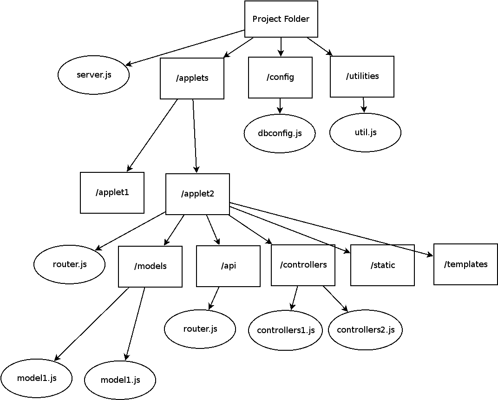
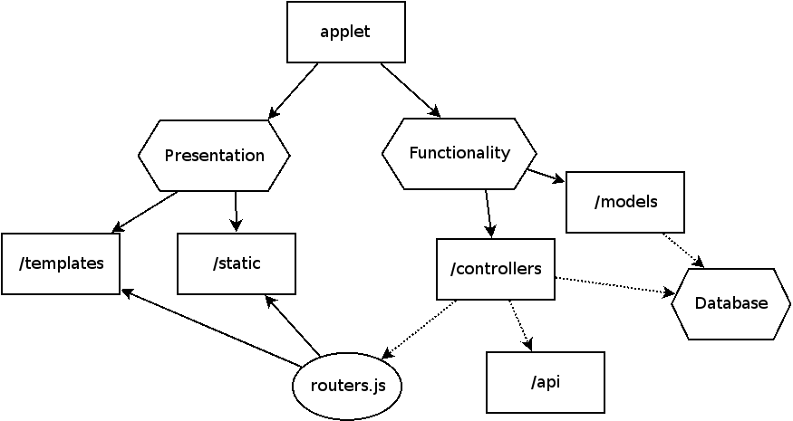

# Yolk CLI - The Oak Framework with Batteries Included

Yolk CLI is an easy to use CLI tool used to create and run Oak web applications. The projects created with Yolk CLI are scalable, maintainable, flexible, easy to run, and are batteries-included, with dynamic links to a variety of Deno technologies that are commonly used in web applications, including a template rendering engine, ORM libraries, session middleware, security middleware, logging middleware, and more.

## Technology Stack in the Yolk CLI

Projects created with the Yolk CLI include dynamic links to the following technologies, which will be downloaded and cached on the first run of the commands in the CLI:

* **[Oak](https://deno.land/x/oak)**: A Koa-based web framework for Deno.
* **[Denon](https://deno.land/x/denon)**: A version of nodemon build specifically for Deno.
* **[DenoDB](https://deno.land/x/denodb)**: An ORM created for Deno with a support for many commonly used databases.
* **[Denjucks](https://deno.land/x/denjucks)**: A template rendering engine ported over from Mozilla's Nunjucks library for Node.
* **[Session](https://deno.land/x/session)**: A middleware for sessions built specifically for Deno web frameworks.
* **[Snelm](https://deno.land/x/snelm)**: A security middleware for Deno web frameworks, ported over from the helmet library for Node.
* **[Organ](https://deno.land/x/organ)**: A logging middleware built for the Oak framework, with similarities to the Morgan library for Node.
* **[Oak-Query-Parser-Async](https://github.com/denjucks/oak-query-parser-async)**: A query string parser middleware for Oak.


## Installing the Yolk CLI

To install the Yolk CLI, simply run the following command:

```
deno install -A -f --unstable https://raw.githubusercontent.com/denjucks/yolk/master/yolk.js
```

If you have the deno installation folder set on your path, you should now be able to access the `yolk` command on the command line. If not, add it to path and restart your terminal.


## Basics of Yolk

Once you have the CLI downloaded, you can create a new project with Yolk in the current directory with the following command:

```
yolk createproject
```

And once created you can run your application with the following command:

```
yolk run
```

This will run the server, as well as rerun the server whenever you make changes to the contents of the project (via the [Denon](https://deno.land/x/denon) library). Now you visit the default page created by the Yolk CLI in the browser at the following URL:

```
http://localhost:55555/main/
```

### Yolk Project Structure

The basic project structure created by the Yolk CLI can be seen in the following diagram



Or in file structure tree format:

```
.
├── applets
│   └── main
│       ├── api
│       │   └── router.js
│       │
│       ├── controllers
│       │   └── mainController.js
│       │
│       ├── models
│       │   └── users.js
│       │
│       ├── router.js
│       │
│       ├── static
│       │   └── yolk.svg
│       │
│       └── templates
│           ├── _base.html
│           └── index.html
│
├── config
│   └── dbconfig.js
│
├── server.js
│
└── utilities
    └── util.js
```

As a basic overview of what each file and folder contains:

* **/applets**: This folder contains all of the applets in this web application. More on applets below.
* **/config**: This folder contains configuations used throughout your web application. Currently this folder only contains a **dbconfig.js** file which contains exports for configuring your database.
* **/utilities:**: This folder contains utilities used internally within the application, and you generally won't be modifying files within this folder.
* **server.js**: This file contains all the configurations for the Oak server. It includes the **routers**, **middleware**, and all basic server configurations (such as the port number chosen, which by default is 55555).

Before looking at the **server.js** and **dbconfig.js** files, lets look at applets, as they make up the core of your web application.


### Applets

Projects created by the Yolk CLI use an applet-based approach. Each broad section of the web application is encapsulated in a folder within the **applets** folder. Applets are a collection of routers, models, templates, static assets, controllers, and and API. The goal with each applet is to create small pieces of functionality and design that can be portable amongst applications and that can be easily added or removed. Applets contain two main purposes, Presentation and Functionality:




#### Functionality

Functionality of the applet is primarily contained within controllers (for small applications you can delete the controllers and just hard code functionality directly within the router.js). Controllers are intended to provide a piece of functionaly that can be decoupled from Presentation (such as fetching data from a database). Controllers are then linked with the presentation through the **router.js** files, which will use functionality of controller and then render templates and static assets. This allows you to decouple the Functionality from the Presentation if necessary. It also allows for flexibility, as for applets that primarily contain a RESTAPI, you can simply remove the presentation pieces of the applet (mainly the /templates, /static, and router.js file) and just keep the functionality portion of the applet.


#### Presentation

Presentation for each applet is primarily contained within **/templates** and **/static** folder, and rendered via a call to a route within the **router.js** file. For applications that have very basic functionality and are primarily concerned with rendering some content and will have no RESTAPI, you can simply remove the functionality portions of the applet (namely the /controllers, /api, and models.js) and just keep the presentiation portion of the applet.


#### Applet Contents

The `createproject` command creates a default applet called `main`, but you can create new applets using the following Yolk CLI command:

```
yolk createapplet mynewapplet
```

Let's look further at the individual pieces of an applet. 

* **router.js** contains the routes for this applet. We can see that the router.js file contains a path prefix which determines how the routes will be accessed on the path, a route for serving static files, and then a base route for the router. Also note that the rendering engine (which uses the [Denjucks](https://deno.land/x/denjucks) library), and a controller are imported for this applet. At the bottom of the file this router is exported, and will be used within the `server.js` file:

```javascript
import { Router } from "https://deno.land/x/oak/mod.ts";
import * as path from "https://deno.land/std/path/mod.ts";
import denjucks from "https://deno.land/x/dinja/lib/denjucks/mod.js";
import * as utilities from "../../utilities/util.js"
import { database } from "../../server.js"
import mainController from "./controllers/mainController.js";

const __dirname = utilities.crossPlatformPathConversion(new URL(".", import.meta.url).pathname);

// Setting up the template rendering engine
const renderingEngine = new denjucks.Environment(new denjucks.FileSystemLoader(path.join(__dirname, "templates")));

// Setting the path prefix for this route
const pathPrefix = "/main";

const router = new Router({ prefix: pathPrefix });

// Creating the static file route for this router
router.get("/static/:filePath", async (context) => {
	const filePath = context.params.filePath;
	let buffer;
	try {
		buffer = await Deno.readFile(path.join(__dirname, "static", filePath));
	} catch (error) {}
	
	return context.response.body = buffer;
});

/* Routes */
router.get("/", async (context) => {
    context.response.body = renderingEngine.render("index.html");
});

export default router;
```

* **/models** contains files for individual database models used throughout your web application and are typically imported by your controllers. Yolk CLI projects use the [DenoDB](https://deno.land/x/denodb) ORM library by default, and so models are created using this library.

```javascript
import Dex from "https://deno.land/x/dinja/lib/dex/mod.ts";
import { dbconfig } from "../../utilities/dbconfig.js";

const dex = Dex({client: dbconfig.client, useNullAsDefault: true});

export const models = [
	dex.schema.createTable("mainUsers", (table) => {
		table.increments("id").primary();
		table.string("username");
		table.string("hashedPassword");
		table.string("firstname", 64);
		table.string("lastname", 64);
		table.string("email");
		table.string("phoneNumber", 32);
		table.timestamps(null, true);
	}).toString(),
]
```

When you create models in the `/models` folder, you can migrate all of the models in all applets using the following command:

```
yolk migrate
```

* **/controllers** contains the funtionality for the routes within the **router.js** file and the **/api** folder. The default controller contains some examples of using the DenoDB library.

* **/templates** contains templates that will be rendered when a route is called. Yolk CLI uses the [Denjucks](https://deno.land/x/denjucks) rendering engine by default, which is a port of Mozilla's Nunjucks rendering engine. However, you can easily swap out the rendering with other engines. Additionally, note that each applet has its own rendering engine, so you can use multiple rendering engines (which can be useful when you have existing templates written in other rendering engines).

* **/static** contains static assets for this particular applet. Static assets are fetched via the static route found within each applet.

* **/api** contains a router for an API for this applet. The API and the router within the base applet folder can use functionality provided by the controllers, making it easy to create an API for this applet.


#### Server Contents

The **server.js** file contains all of the configurations for the server, the middleware, the database initialization, and the routers contained within all applets:

```javascript
import { Application } from "https://deno.land/x/oak/mod.ts";
import Dexecutor from "https://deno.land/x/dexecutor/mod.ts";
import { dbconfig } from "./config/dbconfig.js";
import { queryParserAsync } from "https://raw.githubusercontent.com/denjucks/oak-query-parser-async/master/mod.ts";
import { Snelm } from "https://deno.land/x/snelm/mod.ts";
import { Session } from "https://deno.land/x/session/mod.ts";

const app = new Application();

/* Server configurations */
let port = 55555;
if (Deno.args[0]) {
    port = Number.parseInt(Deno.args[0]);
}


/* Database */
export const database = new Dexecutor(dbconfig);
database.connect();


/* Middleware */
// Query Parser Middleware
app.use(queryParserAsync());

// Security Middleware
const snelm = new Snelm("oak");
await snelm.init();

app.use(async (context, next) => {
    context.response = snelm.snelm(context.request, context.response);

    await next();
});

// Session Middleware
const session = new Session({
    framework: "oak",
    store: "memory",
});
await session.init();
app.use(session.use()(session));


/* Routers */
import main from "./applets/main/router.js";
app.use(main.routes());
app.use(main.allowedMethods());

import mainapi from "./applets/main/api/router.js";
app.use(mainapi.routes());
app.use(mainapi.allowedMethods());


// Starting the server
console.log("Starting server at port: " + port);
await app.listen({ port: port });
```

In this file you will mainly make changes to the Routers section, adding and removing the routers from applets as needed. However, you can also remove middleware if its not needed for your application. For example, if you don't plan on using any sessions, you can simply remove that middleware. Or if you are not planning on using a database, that can be removed too.


#### Database Configuration

Within the `/configs` folder you can configure the database via the **database.js** file. By default Yolk CLI projects use SQLite3 as their database, which is useful for debugging but not the best choice for production applications. You can chose an alternative database using this configuation file. Since the DenoDB library is used for configuration, you can see the documentation [here](https://deno.land/x/denodb) to check out how to modify the configuations for various databases.


### Summary of Yolk CLI commands

```
Available Commands:
    createproject
        "Creates a new project"

    createapplet <applet_name>
        "Creates an new applet with a specified name"
	
    migrate [drop]
        "Migrates all of the models in all of the applets. Add the drop"
        "parameter to drop the existing models in the database in the case"
        "where those models already exist"

    run [<port_number>]
        "Runs the server using denon, restarting the server whenever a file"
        "in the project is updated. You can change the port number by"
        "specifying a port number, with the default set to 55555 if no port"
        "number is chosen"

    --help
        "Displays this help information."
```


## Todo

[x] Create project structure
[x] Create applet structure
[x] Create the Yolk CLI tool
[x] Add rendering engine to the structure (Denjucks library)
[x] Add database functionality to the structure (DenoDB library)
[x] Add nodemon functionality to the structure (Denon library)
[x] Add session middleware (Session library)
[x] Add security middleware (Snelm library)
[x] Add query string parsing middleware (Oak-Async-Query-Parser library)
[x] Add logging middleware (Organ library)
[ ] Add compression middleware
[ ] Add CSRF middleware
[ ] Add default 404 page
[ ] Improve structure


## License

MIT License

Copyright (c) 2020 Anthony Mancini

Permission is hereby granted, free of charge, to any person obtaining a copy of this software and associated documentation files (the "Software"), to deal in the Software without restriction, including without limitation the rights to use, copy, modify, merge, publish, distribute, sublicense, and/or sell copies of the Software, and to permit persons to whom the Software is furnished to do so, subject to the following conditions:

The above copyright notice and this permission notice shall be included in all copies or substantial portions of the Software.

THE SOFTWARE IS PROVIDED "AS IS", WITHOUT WARRANTY OF ANY KIND, EXPRESS OR IMPLIED, INCLUDING BUT NOT LIMITED TO THE WARRANTIES OF MERCHANTABILITY, FITNESS FOR A PARTICULAR PURPOSE AND NONINFRINGEMENT. IN NO EVENT SHALL THE AUTHORS OR COPYRIGHT HOLDERS BE LIABLE FOR ANY CLAIM, DAMAGES OR OTHER LIABILITY, WHETHER IN AN ACTION OF CONTRACT, TORT OR OTHERWISE, ARISING FROM, OUT OF OR IN CONNECTION WITH THE SOFTWARE OR THE USE OR OTHER DEALINGS IN THE SOFTWARE.
